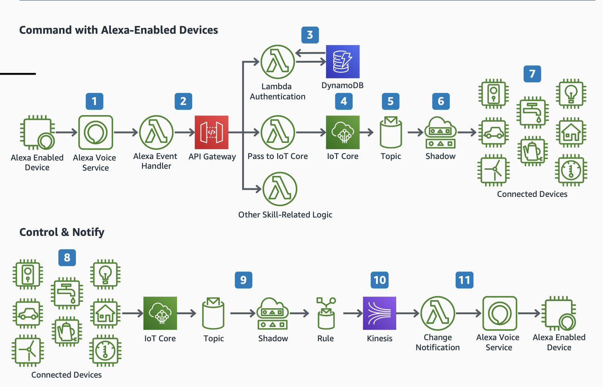

# Alexa - Connected Home: Command and Control

Simple architecture diagram of how Alexa sends commands to connected devices and receives notifications from them 

1. An Alexa invocation is created by an Alexa Enabled Device running either the Alexa Voice Services SDK or using an Amazon Echo.

2. Alexa Skill uses AWS Lambda as its backend logic. Amazon API Gateway handles validating the authorization and access control for the Alexa skill before it sends data to the correct Skill Handler.

3. Amazon DynamoDB holds user authorization data that associates your users to their skill and devices while API Gateway verifies whether the request should be accepted.

4. AWS IoT Core enables you to connect devices to the cloud. IoT Core sends and receives updates based on Alexa invocations.

5. Each Alexa invocation triggers an IoT Rule, which evaluates each invocation and routes the message to other AWS Services.

6. Each Alexa invocation triggers a message to the AWS IoT Device Shadow. The Shadow service then sends a message to the device with settings that need to be updated to match the Alexa request

7. IoT data is sent securely from AWS IoT Core to the devices that need to take action based on the Alexa command.

8. In addition to commands, Alexa also can receive updates of device data that happens locally. IoT data originated by your devices can send data to AWS IoT Core using AWS IoT SDK, AWS IoT Greengrass, or Amazon FreeRTOS.

9. Messages from the devices are sent to IoT Core, which uses an IoT rule to write data to Amazon Kinesis Data Streams.

10. Real-time data is streamed from Amazon Kinesis Data Streams, Amazon Kinesis Data Analytics, Spark (EMR), EC2, Lambda, and other services that extract data for processing.

11. The notifications interface to Alexa Voice Service is invoked in the AWS Lambda function. It gives users a visual or audio indication that new content is available from Alexa domains or an enabled Alexa skill.