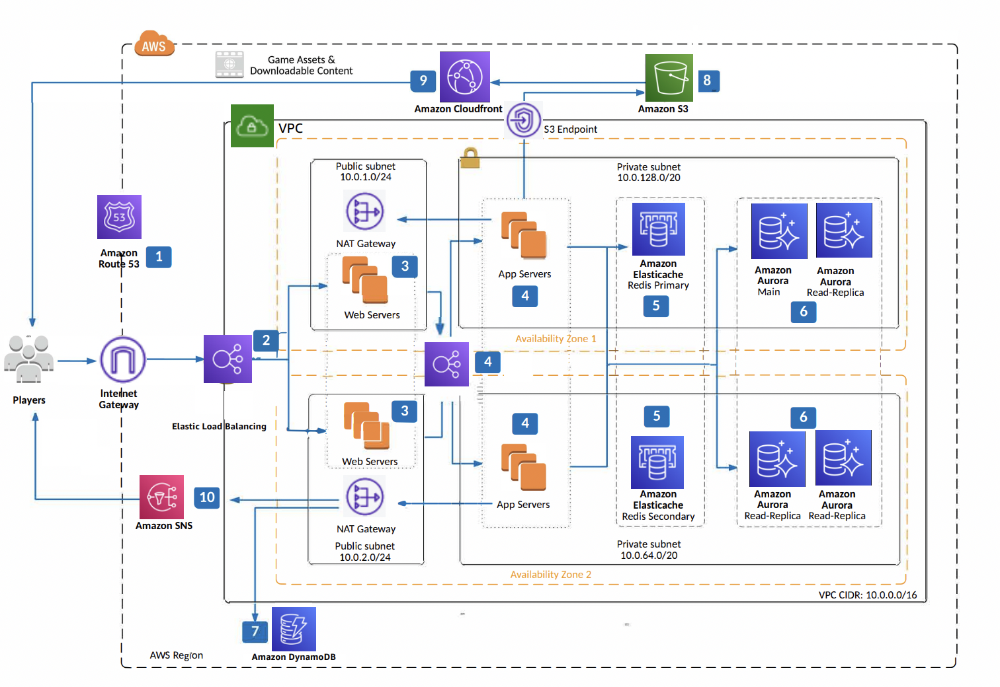

# Asynchronous Online Gaming

As mentioned on the AWS Reference Architecture site, this architecture is intended for mobile and online games. It is highly available, scalable & elastic to support millions of players.  

1. Route 53 is used for DNS resolution and to ensure that the service endpoints are up at all times with the help of health checks.

2. ELB is used for load balancing and is highly available out of the box. It also provides SSL termination for HTTPS traffic.

3. EC2 servers lauched in a target group.

4. Internal load balancer wired up to appservers.

5. Elasticache for Redis for caching. The appservers talk to the Redis primary. The secondary Redis is on standby.

6. Amazon Aurora for storing the data. Read replicas in the same AZ as well in a different AZ.

7. DynamoDB can be used as an alternative for high speed, low latency.
   
8,9. S3 for storing game assets. Cloudfront for global edge caching.

10.  SNS used for push notifications