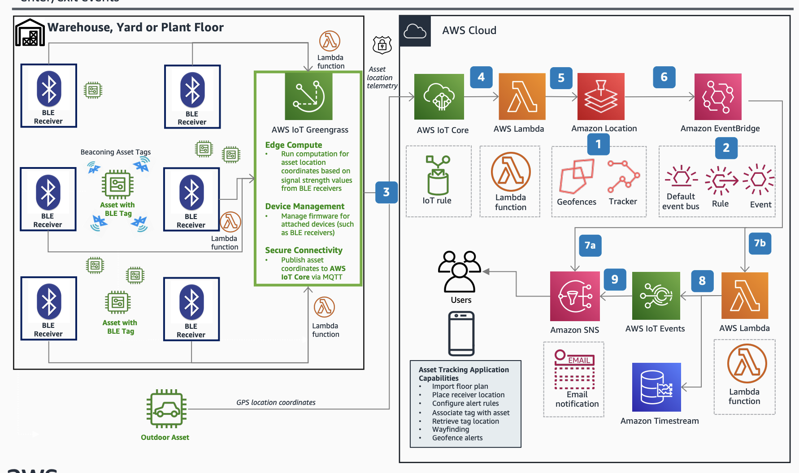

# Geofencing with Amazon Location Service and AWS IoT 
## Tracking high-value equipment leaving or entering premises

The diagram provides guidance for integrating Amazon Location with AWS IoT Core to create alert notifications for Internet of Things (IoT) devices moving in and out of geofences. This scenario uses Bluetooth Low Energy (BLE) tagged asset locations in a warehouse using an arbitrary x, y coordinate system. GPS coordinates can be used outdoors.

1. Create a Geofence Collection resource in [Amazon Location](https://aws.amazon.com/location/) adding one or more Geofences to it. Create the Location Tracker resource and associate it with the Geofence collection. This sets up the service to send geofence events to Amazon EventBridge.
   
2. Configure [EventBridge](https://aws.amazon.com/eventbridge/) to invoke AWS Lambda for the event received from the service. Write a Lambda function for processing the event

3. Publish asset position to AWS IoT Core directly or via AWS [IoT Greengrass](https://aws.amazon.com/greengrass/). Using AWS IoT Core in the path allows for asset metadata management using IoT Thing models.

4. The IoT Rule in AWS IoT Core invokes the Lambda function. (No out-of-the-box IoT rule currently exists for Amazon Location Service.)

5. Write a Lambda function to send location (DeviceID, x, y) to the Location Tracker.

6. Location Tracker maintains device position history, and the associated geofence collection publishes enter/exit events to the default event bus in EventBridge.
 
7a. Publish the event to an Amazon Simple Notification Service (Amazon SNS) topic directly from EventBridge to notify end user.

7b. To further process the raw geofence events, configure an EventBridge rule to invoke a Lambda function (optional)

8. Add a Lambda function to forward to AWS IoT Events for complex event detection (optional) and to store event history as a time series in [Amazon Timestream](https://aws.amazon.com/timestream/).

9. Publish the complex event detected to an Amazon SNS topic to notify the end user