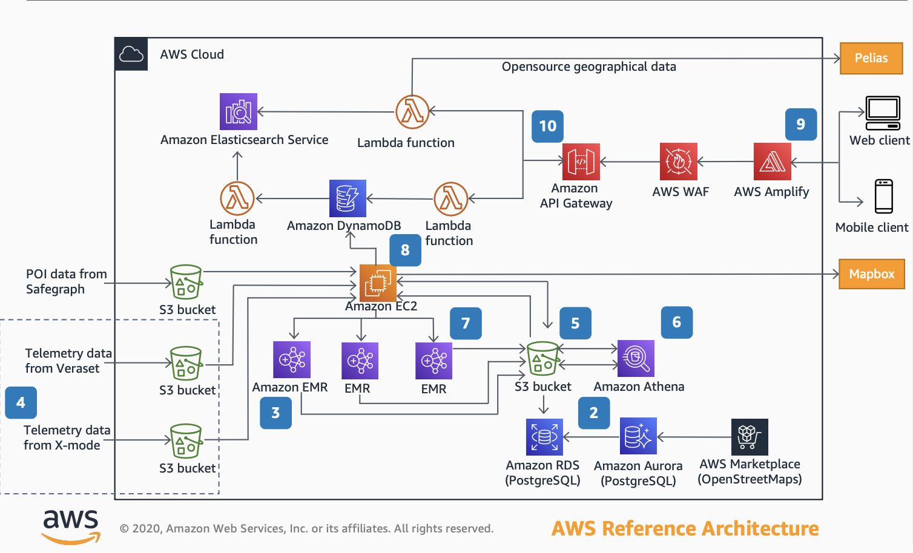

# Mobile Application for Social Distancing

Crowdfree was a social distancing app built by Tripadvisor during the pandemic to enable users to see the presence of people in stores and public spaces. Here's the architecture of the app from the AWS Reference Architecture site.

The services above the EC2 instance roughly comprise the frontend with the parts below being the backend.

1. Apache Airflow is hosted on an Amazon Elastic Compute Cloud (Amazon EC2) instance to orchestrate the entire workflow for this application. 

   (Apache Airflow is a workflow management platform similar to AWS Step Functions. In fact, I'm not sure why Step Functions was not used in this case - [Step Functions vs Airflow](https://stackoverflow.com/questions/64016869/airflow-versus-aws-step-functions-for-workflow))

2. Point-of-Interest (POI) data from [Safegraph](https://www.safegraph.com/) is combined with data from [OpenStreetMap (OSM)](https://www.openstreetmap.org/#map=4/21.84/82.79) into Amazon Relational Database Service (Amazon RDS) PostgreSQL database.

    (Safegraph is a database of global points of interest )

3. Polygon data from both Safegraph and OSM is indexed by H3 hexes via an Amazon EMR process.

    (I found this really interesting. H3 has been discussed on Uber's blog [here](https://www.uber.com/en-IN/blog/h3/). It's Uber's grid system used for analyzing geographic patterns to optimize their ride pricing and dispatch. The repository is open source and is located [here](https://h3geo.org/) )

4. Telemetry data from Veraset and Xmode is ingested daily and get indexed
on H3 hexes.

5. The processed POI and telemetry data get saved in a centralized Amazon S3 bucket.

6. All the processed data is combined using H3 indexes and geospatial functions provided by Amazon Athena.

7. An EMR process ingests aggregated data from the Athena flow. The EMR process creates GeoJSON data and saves it back to the S3 bucket.

8. The GeoJSON data is loaded in the map layer of Mapbox and Amazon DynamoDB.          
    
    (GeoJSON is a format for encoding a variety of geographic data structures.)

9. The front-end app is a react application deployed using AWS Amplify. The client calls Mapbox for map layers

10. Amazon API Gateway has two AWS Lambda functions configured as endpoints: one for search, and other for POI details.