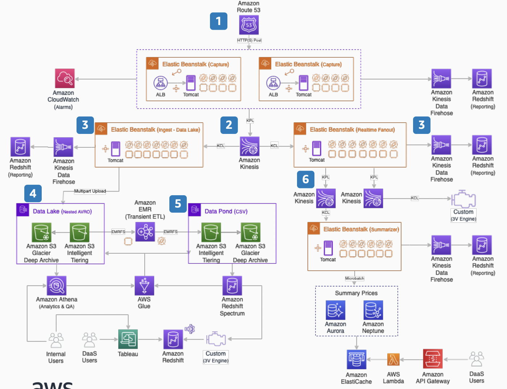

# Streaming Airline Ticket Shopping Insights

3Victors implemented an AWS cloud-based architecture to capture and durably store over 10Tb of daily streamed air shopping data messages into a [Data Lake](https://aws.amazon.com/big-data/datalakes-and-analytics/what-is-a-data-lake/). Dozens of ETL jobs run at regular intervals to populate use case specific Data Ponds. Simultaneously, the implementation provides an extensible, real-time predictive analytics pipeline for demand forecasting and deal classification.

1. Amazon Route 53 directs per stream vendor content to an AWS Elastic
Beanstalk application. Cloudwatch Alarms are setup to ensure that this runs smoothly. Also, application specific statistics are sent to Redshift via Kinesis Data Firehose

2. The captured pricing data is serialized and placed on a 24hour Kinesis streaming buffer balanced across 100+ shards supporting checkpoint time range replay for downstream issue remediation.  helps  consume and process data from a Kinesis data stream by taking care of many of the complex tasks associated with distributed computing.

3. Two concurrent pipelines fan out from the streaming buffer feeding AWS Elastic Beanstalk compute clusters that read and deserialize the data in real time.

4. A Data Lake pipeline durably persists in a cost-optimized Amazon S3 Intelligent
Tiering bucket via multipart upload with directory paths suitable for partitioning
and cross account accessibility.

5. Periodic ETL jobs based on customer SLA deposit results into cross account
accessible Data Ponds using the Amazon EMR transient massively parallel compute
framework, cost optimized with spot instance fleets

6. A real-time analytics pipeline fans out to unlimited Amazon Kinesis stream buffers
that support an extensible micro-batching framework. A default use case populates
Amazon Aurora (row) and Amazon Neptune (graph) databases for customer API
access via serverless Amazon API Gateway and AWS Lambda. Database I/O
optimized using Amazon ElastiCache cache